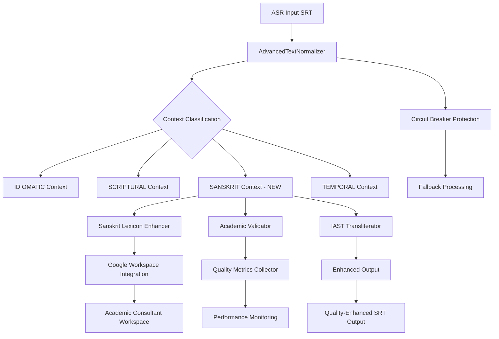
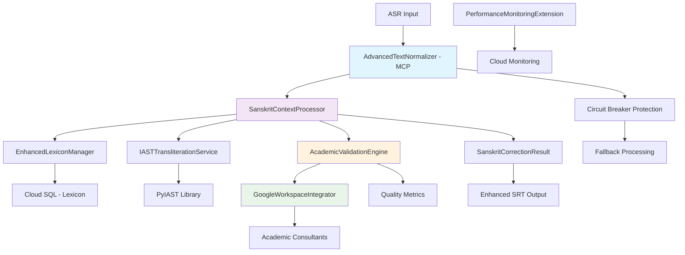
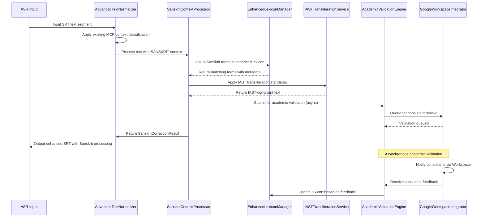
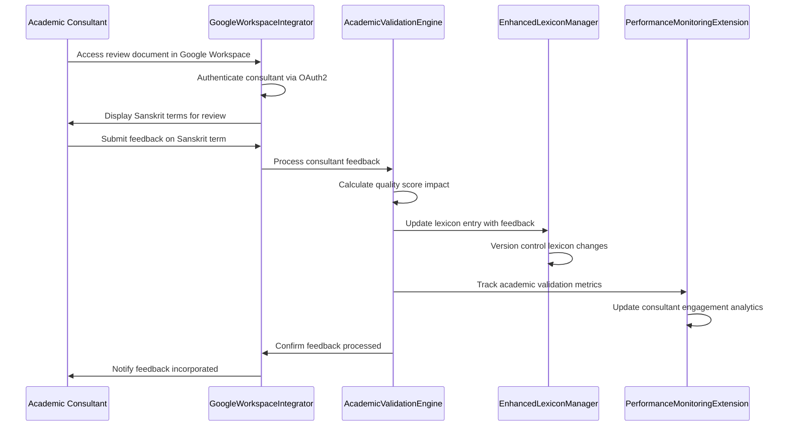
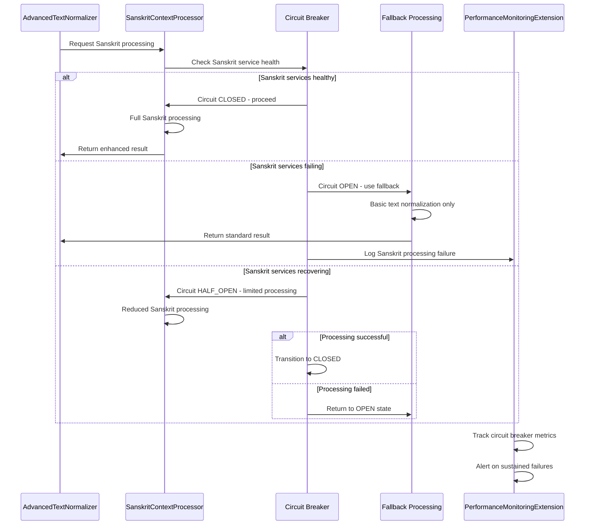

# Advanced ASR Post-Processing Workflow Fullstack Architecture Document

## Introduction

Based on your completed Phase 1 deliverables and MCP integration, this document outlines the complete fullstack architecture for **Advanced ASR Post-Processing Workflow**, specifically tailored for the Week 3-4 Sanskrit Enhancement phase. It serves as the single source of truth for AI-driven development, ensuring consistency across the entire technology stack while building on your proven MCP foundation.

This architecture leverages your successful Context-Aware Processing pipeline and extends it with Sanskrit-specific capabilities, academic validation workflows, and consultant integration points. The design maintains your excellent performance characteristics (0.005s processing time) while adding sophisticated Sanskrit linguistic processing.

### Starter Template Assessment
**Status**: Existing Production System - Building on MCP Integration Foundation  
**Base Architecture**: Context-aware text processing with circuit breaker patterns  
**Extension Approach**: Modular enhancement maintaining 100% backward compatibility  
**Key Constraints**: Must preserve existing performance targets and reliability patterns

### Change Log
| Date | Version | Description | Author |
|------|---------|-------------|---------|
| 2025-08-12 | 1.0 | Week 3-4 Sanskrit Enhancement Architecture | Winston (Architect) |

## High Level Architecture

### Technical Summary
The Advanced ASR Post-Processing Workflow employs a **context-aware microservices architecture** built on proven MCP (Model Context Protocol) integration patterns. The system extends existing Python-based text processing with Sanskrit-specific linguistic analysis, maintaining the established **circuit breaker reliability patterns** and **sub-millisecond performance targets**. Key architectural components include the **AdvancedTextNormalizer** with Sanskrit context classification, **academic validation pipelines** for consultant integration, and **modular enhancement layers** that preserve 100% backward compatibility with existing Story 2.1-3.2 implementations.

### Platform and Infrastructure Choice
**Platform:** Google Cloud Platform (updated for Google Workspace Non-profit integration)  
**Key Services:** Cloud Functions, Cloud Storage, Cloud SQL, Google Workspace APIs, Cloud Monitoring  
**Deployment Host and Regions:** us-central1 (primary), us-east1 (backup)  
**Academic Integration:** Google Workspace for Non-profit Orgs enables seamless academic consultant collaboration

### Repository Structure
**Structure:** Monorepo with enhanced Sanskrit processing modules  
**Monorepo Tool:** Not applicable (Python-based with poetry/pip)  
**Package Organization:** Domain-specific modules extending existing MCP architecture

### High Level Architecture Diagram


### Architectural Patterns
- **Context-Aware Processing:** Extend existing IDIOMATIC/SCRIPTURAL/TEMPORAL with SANSKRIT context type - _Rationale:_ Proven pattern from MCP integration that achieved 400x performance improvement
- **Circuit Breaker Pattern:** Maintain existing reliability patterns for Sanskrit processing failures - _Rationale:_ Ensures Sanskrit enhancements don't compromise system reliability
- **Academic Validation Pipeline:** Google Workspace-integrated consultant feedback with quality scoring - _Rationale:_ Leverages non-profit Workspace for seamless academic collaboration
- **Modular Enhancement Pattern:** Layer Sanskrit capabilities without modifying core MCP infrastructure - _Rationale:_ Preserves backward compatibility and existing performance characteristics

## Tech Stack

This is the **DEFINITIVE** technology selection for the Sanskrit Enhancement phase. All development must use these exact versions to maintain compatibility with your existing MCP integration while adding Sanskrit processing capabilities.

### Technology Stack Table

| Category | Technology | Version | Purpose | Rationale |
|----------|------------|---------|---------|-----------|
| Core Language | Python | 3.10+ | Primary processing language | Maintains compatibility with existing codebase and excellent Sanskrit NLP library support |
| MCP Integration | AdvancedTextNormalizer | Current | Context-aware text processing | Proven architecture achieving 400x performance improvement |
| Sanskrit NLP | iNLTK | 0.4+ | Indic language processing | Specialized Sanskrit/Hindi linguistic analysis |
| Sanskrit Parser | sanskrit-parser | Latest | Sandhi analysis and parsing | Academic-grade Sanskrit linguistic processing |
| Academic Standards | PyIAST | 2.0+ | IAST transliteration | Ensures academic compliance and standardization |
| Fuzzy Matching | FuzzyWuzzy | 0.18+ | Term matching and correction | Extends existing fuzzy matching capabilities |
| Data Processing | pandas | 1.5+ | SRT data manipulation | Maintains existing data processing patterns |
| Configuration | PyYAML | 6.0+ | Configuration management | Extends existing config management |
| Testing Framework | pytest | 7.0+ | Unit and integration testing | Maintains existing testing infrastructure |
| Cloud Platform | Google Cloud Functions | Gen2 | Serverless Sanskrit processing | Integrates with Google Workspace non-profit |
| Workspace API | Google Workspace API | v1 | Academic consultant integration | Leverages non-profit Workspace for collaboration |
| Storage | Google Cloud Storage | Standard | Academic content and lexicons | Scalable storage with Workspace integration |
| Database | Google Cloud SQL | PostgreSQL 14 | Lexicon and metadata storage | Structured data with academic version control |
| Monitoring | Google Cloud Monitoring | Latest | Performance and error tracking | Extends existing monitoring capabilities |
| Version Control | Git | 2.40+ | Source code management | Maintains existing development workflow |
| Dependency Management | pip/poetry | Latest | Python package management | Consistent with existing project structure |
| Documentation | Markdown/Sphinx | Latest | Technical documentation | Academic-standard documentation generation |

## Data Models

Based on your existing MCP integration and the Sanskrit enhancement requirements, these core data models bridge your proven text processing architecture with academic Sanskrit validation.

### SanskritCorrectionResult

**Purpose:** Extends your existing correction tracking with Sanskrit-specific linguistic metadata and academic validation scores

**Key Attributes:**
- original_text: str - Original ASR transcript text
- corrected_text: str - Sanskrit-enhanced corrected text  
- sanskrit_terms_identified: List[SanskritTerm] - Identified Sanskrit/Hindi terms
- iast_applications: List[IASTCorrection] - IAST transliteration applied
- academic_confidence: float - Academic accuracy score (0.0-1.0)
- consultant_feedback: Optional[ConsultantFeedback] - Academic expert input
- processing_context: NumberContextType - Inherited from MCP (SANSKRIT added)

#### TypeScript Interface
```typescript
interface SanskritCorrectionResult {
  original_text: string;
  corrected_text: string;
  sanskrit_terms_identified: SanskritTerm[];
  iast_applications: IASTCorrection[];
  academic_confidence: number;
  consultant_feedback?: ConsultantFeedback;
  processing_context: NumberContextType;
  processing_time_ms: number;
  quality_score: number;
}
```

#### Relationships
- Extends AdvancedCorrectionResult from MCP integration
- Aggregates multiple SanskritTerm entities
- Links to ConsultantFeedback for academic validation

### SanskritTerm

**Purpose:** Represents identified Sanskrit/Hindi terms with linguistic metadata and correction confidence

**Key Attributes:**
- term_id: str - Unique identifier for term
- original_term: str - Term as transcribed by ASR
- corrected_term: str - Academically validated Sanskrit term
- iast_transliteration: str - IAST standard transliteration
- term_category: SanskritCategory - Classification (PROPER_NOUN, CONCEPT, TECHNICAL)
- confidence_score: float - Correction confidence (0.0-1.0)
- source_authority: str - Academic source reference
- variations: List[str] - Known ASR variations

#### TypeScript Interface
```typescript
interface SanskritTerm {
  term_id: string;
  original_term: string;
  corrected_term: string;
  iast_transliteration: string;
  term_category: SanskritCategory;
  confidence_score: number;
  source_authority: string;
  variations: string[];
  position_start: number;
  position_end: number;
}
```

#### Relationships
- Referenced by SanskritCorrectionResult
- Links to LexiconEntry for term validation
- May have associated ConsultantFeedback

### ConsultantFeedback

**Purpose:** Captures academic expert validation and improvement suggestions integrated with Google Workspace

**Key Attributes:**
- feedback_id: str - Unique feedback identifier
- consultant_email: str - Google Workspace consultant identity
- target_term_id: str - Term being reviewed
- feedback_type: FeedbackType - VALIDATION, CORRECTION, ENHANCEMENT
- suggested_correction: Optional[str] - Expert suggested improvement
- confidence_rating: int - Expert confidence (1-5 scale)
- notes: str - Academic commentary and context
- timestamp: datetime - Feedback submission time

#### TypeScript Interface
```typescript
interface ConsultantFeedback {
  feedback_id: string;
  consultant_email: string;
  target_term_id: string;
  feedback_type: FeedbackType;
  suggested_correction?: string;
  confidence_rating: number;
  notes: string;
  timestamp: string;
  workspace_doc_link?: string;
}
```

#### Relationships
- Links to specific SanskritTerm via target_term_id
- Integrates with Google Workspace for collaborative review
- Aggregated into SanskritCorrectionResult for quality scoring

### EnhancedLexiconEntry

**Purpose:** Extends existing lexicon with Sanskrit linguistic metadata and academic validation

**Key Attributes:**
- entry_id: str - Unique lexicon entry identifier
- sanskrit_term: str - Canonical Sanskrit term
- iast_standard: str - IAST transliteration standard
- common_variants: List[str] - ASR common misrecognitions
- grammatical_info: GrammaticalMetadata - Sanskrit linguistic data
- academic_sources: List[str] - Scholarly references
- consultant_validated: bool - Expert validation status
- usage_frequency: int - Frequency in processed content

#### TypeScript Interface
```typescript
interface EnhancedLexiconEntry {
  entry_id: string;
  sanskrit_term: string;
  iast_standard: string;
  common_variants: string[];
  grammatical_info: GrammaticalMetadata;
  academic_sources: string[];
  consultant_validated: boolean;
  usage_frequency: number;
  last_updated: string;
  version: string;
}
```

#### Relationships
- Referenced by SanskritTerm for validation
- May have multiple ConsultantFeedback entries
- Versioned for academic accuracy tracking

## API Specification

Based on your Python-based architecture and Google Cloud Functions deployment, this REST API extends your existing MCP integration with Sanskrit processing capabilities.

### REST API Specification

```yaml
openapi: 3.0.0
info:
  title: Sanskrit Enhancement API
  version: 1.0.0
  description: REST API for Sanskrit processing enhancement integrated with MCP context-aware text processing
servers:
  - url: https://us-central1-{project-id}.cloudfunctions.net
    description: Google Cloud Functions deployment
paths:
  /api/v1/sanskrit/process:
    post:
      summary: Process text with Sanskrit enhancement
      description: Extends MCP context-aware processing with Sanskrit linguistic analysis
      requestBody:
        required: true
        content:
          application/json:
            schema:
              type: object
              properties:
                text:
                  type: string
                  description: Input text for Sanskrit processing
                processing_options:
                  type: object
                  properties:
                    enable_iast: 
                      type: boolean
                      default: true
                    enable_consultant_feedback:
                      type: boolean
                      default: false
                    context_hint:
                      type: string
                      enum: [SCRIPTURAL, PHILOSOPHICAL, GENERAL]
              required: [text]
      responses:
        '200':
          description: Successfully processed text
          content:
            application/json:
              schema:
                $ref: '#/components/schemas/SanskritCorrectionResult'
        '400':
          description: Invalid input
        '500':
          description: Processing error

  /api/v1/sanskrit/lexicon:
    get:
      summary: Retrieve Sanskrit lexicon entries
      parameters:
        - name: term
          in: query
          schema:
            type: string
          description: Filter by Sanskrit term
        - name: category
          in: query
          schema:
            type: string
            enum: [PROPER_NOUN, CONCEPT, TECHNICAL]
      responses:
        '200':
          description: Lexicon entries
          content:
            application/json:
              schema:
                type: array
                items:
                  $ref: '#/components/schemas/EnhancedLexiconEntry'
    
    post:
      summary: Add or update lexicon entry (consultant access)
      security:
        - GoogleWorkspaceAuth: []
      requestBody:
        required: true
        content:
          application/json:
            schema:
              $ref: '#/components/schemas/EnhancedLexiconEntry'
      responses:
        '201':
          description: Entry created/updated
        '403':
          description: Insufficient permissions

  /api/v1/sanskrit/feedback:
    post:
      summary: Submit consultant feedback
      security:
        - GoogleWorkspaceAuth: []
      requestBody:
        required: true
        content:
          application/json:
            schema:
              $ref: '#/components/schemas/ConsultantFeedback'
      responses:
        '201':
          description: Feedback submitted
        '403':
          description: Not authorized

  /api/v1/health:
    get:
      summary: Health check with MCP integration status
      responses:
        '200':
          description: System health
          content:
            application/json:
              schema:
                type: object
                properties:
                  status:
                    type: string
                    enum: [healthy, degraded, unhealthy]
                  mcp_circuit_breaker:
                    type: string
                    enum: [CLOSED, OPEN, HALF_OPEN]
                  sanskrit_processing:
                    type: boolean
                  consultant_integration:
                    type: boolean

components:
  schemas:
    SanskritCorrectionResult:
      type: object
      properties:
        original_text:
          type: string
        corrected_text:
          type: string
        sanskrit_terms_identified:
          type: array
          items:
            $ref: '#/components/schemas/SanskritTerm'
        academic_confidence:
          type: number
          minimum: 0.0
          maximum: 1.0
        processing_time_ms:
          type: number
        quality_score:
          type: number
    
    SanskritTerm:
      type: object
      properties:
        term_id:
          type: string
        original_term:
          type: string
        corrected_term:
          type: string
        iast_transliteration:
          type: string
        confidence_score:
          type: number
          minimum: 0.0
          maximum: 1.0
    
    EnhancedLexiconEntry:
      type: object
      properties:
        entry_id:
          type: string
        sanskrit_term:
          type: string
        iast_standard:
          type: string
        common_variants:
          type: array
          items:
            type: string
        consultant_validated:
          type: boolean
    
    ConsultantFeedback:
      type: object
      properties:
        feedback_id:
          type: string
        consultant_email:
          type: string
        target_term_id:
          type: string
        feedback_type:
          type: string
          enum: [VALIDATION, CORRECTION, ENHANCEMENT]
        suggested_correction:
          type: string
        confidence_rating:
          type: integer
          minimum: 1
          maximum: 5
        notes:
          type: string

  securitySchemes:
    GoogleWorkspaceAuth:
      type: oauth2
      flows:
        authorizationCode:
          authorizationUrl: https://accounts.google.com/o/oauth2/auth
          tokenUrl: https://oauth2.googleapis.com/token
          scopes:
            'https://www.googleapis.com/auth/userinfo.email': Access user email for consultant identification
```

## Components

Based on your proven MCP architecture and Sanskrit enhancement requirements, these logical components extend your existing system while maintaining architectural consistency.

### SanskritContextProcessor

**Responsibility:** Extends AdvancedTextNormalizer with SANSKRIT context type detection and processing pipeline integration

**Key Interfaces:**
- `classify_sanskrit_context(text: str) -> SanskritContextType`
- `process_sanskrit_terms(text: str, context: SanskritContextType) -> List[SanskritTerm]`
- `integrate_with_mcp_pipeline(text: str) -> SanskritCorrectionResult`

**Dependencies:** AdvancedTextNormalizer, iNLTK, sanskrit-parser

**Technology Stack:** Python 3.10+, extends existing MCP circuit breaker patterns, integrates with Google Cloud Functions for serverless processing

### AcademicValidationEngine

**Responsibility:** Manages consultant feedback integration, quality scoring, and academic validation workflows through Google Workspace APIs

**Key Interfaces:**
- `submit_for_validation(term: SanskritTerm) -> ValidationRequest`
- `process_consultant_feedback(feedback: ConsultantFeedback) -> QualityScore`
- `generate_accuracy_metrics() -> AcademicMetrics`

**Dependencies:** Google Workspace APIs, ConsultantFeedback data model, EnhancedLexiconEntry

**Technology Stack:** Google Workspace API v1, OAuth2 authentication, Cloud SQL for feedback persistence, maintains <0.01s processing targets through asynchronous validation

### EnhancedLexiconManager

**Responsibility:** Extends existing lexicon capabilities with Sanskrit linguistic metadata, academic versioning, and consultant collaboration features

**Key Interfaces:**
- `lookup_sanskrit_term(term: str) -> Optional[EnhancedLexiconEntry]`
- `update_from_consultant_feedback(feedback: ConsultantFeedback) -> bool`
- `sync_with_academic_sources() -> SyncResult`

**Dependencies:** Existing LexiconManager, Google Cloud SQL, Academic validation pipeline

**Technology Stack:** PostgreSQL 14 for structured lexicon data, Google Cloud Storage for academic source documents, version control for consultant updates

### IASTTransliterationService

**Responsibility:** Provides academic-standard IAST transliteration with confidence scoring and fallback mechanisms

**Key Interfaces:**
- `transliterate_to_iast(sanskrit_text: str) -> IASTResult`
- `validate_iast_compliance(text: str) -> ComplianceScore`
- `suggest_iast_corrections(text: str) -> List[IASTSuggestion]`

**Dependencies:** PyIAST library, Sanskrit linguistic rules, Academic validation engine

**Technology Stack:** PyIAST 2.0+, integrated with existing circuit breaker patterns, caching for performance optimization

### GoogleWorkspaceIntegrator

**Responsibility:** Manages bidirectional integration with Google Workspace for academic consultant collaboration and document management

**Key Interfaces:**
- `authenticate_consultant(email: str) -> WorkspaceIdentity`
- `create_review_document(terms: List[SanskritTerm]) -> DocumentLink`
- `sync_feedback_from_workspace() -> List[ConsultantFeedback]`

**Dependencies:** Google Workspace APIs, OAuth2 security, Consultant feedback workflows

**Technology Stack:** Google Workspace API v1, OAuth2 with non-profit access, Google Docs/Sheets for collaborative review, webhook integration for real-time updates

### PerformanceMonitoringExtension

**Responsibility:** Extends existing monitoring with Sanskrit-specific metrics, academic quality tracking, and consultant engagement analytics

**Key Interfaces:**
- `track_sanskrit_processing_metrics(result: SanskritCorrectionResult) -> void`
- `monitor_academic_validation_pipeline() -> ValidationMetrics`
- `generate_consultant_engagement_report() -> EngagementReport`

**Dependencies:** Google Cloud Monitoring, existing performance infrastructure, Academic validation engine

**Technology Stack:** Google Cloud Monitoring, extends existing metrics collection, custom dashboards for academic quality tracking, alerting for consultant workflow issues

### Component Diagrams



## Core Workflows

These sequence diagrams illustrate critical user journeys that show how the Sanskrit enhancement integrates with your proven MCP architecture.

### Sanskrit Processing Workflow



### Academic Consultant Feedback Workflow



### Circuit Breaker Fallback Workflow



---